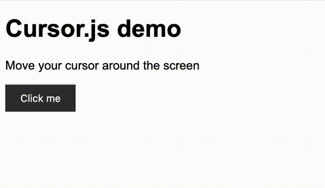

# Cursor.js

A fancy cursor for your website



## Quick Start

Its really simple to use Cursor.js in your website. Just include the script and css file in your HTML and you are good to go.

Add this link to your head tag in your HTML file.
```html
<link rel="stylesheet" href="https://0x4248.github.io/cursor.js/css/cursor.css">
```

Add this script tag to your body tag in your HTML file.
```html
<script src="https://0x4248.github.io/cursor.js/js/cursor.js"></script>
```

Then at the top of your body tag add the following code.
```html
<div class="cursor"></div>  
<div class="cursor-inner"></div>
```

Your page should look like this.

```html
<!DOCTYPE html>

<html>
    <head>
        <!-- Everting else in head -->
        <link rel="stylesheet" href="https://0x4248.github.io/cursor.js/css/cursor.css">
    </head>
    <body>
        <div class="cursor"></div>  
        <div class="cursor-inner"></div>    
        <!-- Site HTML -->
        <script src="https://0x4248.github.io/cursor.js/js/cursor.js" async defer></script>
    </body>
</html>
```

And you are done. Now you have a fancy cursor on your website.

## Customization

You can use the dark theme by adding the following below the css link in the head tag.
```html
<link rel="stylesheet" href="https://0x4248.github.io/cursor.js/css/dark_mode.css">
```

You can also change the color of the cursor by adding the following code below the css link in the head tag.
```html
.cursor {
    background-color: rgba(226, 0, 0, 0.239);
}

.cursor-inner {
    background-color: rgba(255, 152, 152, 0.447);
}
```

Now our cursor will have a red color.


## Minified Version

You can also use the minified version of the script which is smaller in size by about half a kilobyte. Just replace the script tag with the following code.

```html
<script src="https://0x4248.github.io/cursor.js/js/cursor.min.js"></script>
```

## Tooltips

You can also add tooltips to your website. Just add the following code to your HTML file.


Just simply call the function `showTooltip()` with the text you want to display as the argument.

```html
<button onmouseover="showTooltip('Click me')" onmouseout="hideTooltip()">Hover me</button>
```

## Licence

This is licenced under the GNU General Public License v3.0. Please read the [LICENCE](LICENCE) file for more information.